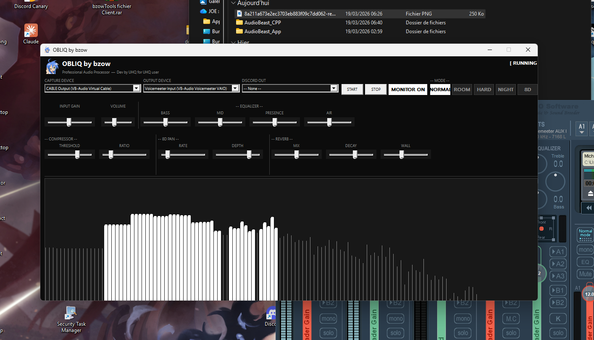

# ObliQ — Professional Audio Processor

> **Dev by UHQ for UHQ user**



ObliQ is a real-time audio processing application for Windows. It intercepts your system audio output and applies professional-grade DSP — compression, EQ, loudness maximization, and creative modes — with zero latency overhead and no external dependencies.

---

## Features

- **Real-time WASAPI loopback** — captures system audio at the driver level (shared mode, 48 kHz stereo float32)
- **Lock-free audio engine** — SPSC ring buffer, per-sample DSP pipeline, thread-safe parameter updates
- **LoudnessMax AGC** — automatic gain control that intelligently pushes your mix to maximum perceived loudness
- **Live FFT spectrum analyzer** — 2048-point Cooley-Tukey FFT with smooth decay display
- **3 processing modes:**
  - `NORMAL` — transparent loudness maximization with clean compression
  - `ROOM` — nightclub bathroom acoustic simulation (LPF cascade + bass resonance + multi-tap reverb + stereo narrowing)
  - `HARD` — extreme multi-stage harmonic saturation / destruction
- **Full parameter control** via sliders: Input Gain, Volume, Reverb Mix, Reverb Decay, Room Wall character
- **Settings persistence** — all slider positions and device selections saved to `ObliQ.ini` next to the executable
- **Device selector** — choose any input/output audio device from the UI
- **Pure Win32 GDI UI** — no frameworks, no DLLs, no runtime dependencies

---

## Requirements

- Windows 10 / 11 (x64)
- WASAPI-compatible audio device

---

## Build

**Prerequisites:** Visual Studio Build Tools 2019+ (MSVC cl.exe)

```bat
cd AudioBeast_CPP
rebuild.bat
```

The script:
1. Compiles `resource.rc` with `rc.exe` to embed the icon
2. Compiles `main.cpp` with MSVC at `/O2` optimization
3. Links against: `ole32`, `oleaut32`, `mmdevapi`, `comctl32`, `gdi32`, `user32`, `shell32`
4. Launches `AudioBeast.exe` on success

No CMake, no vcpkg, no package manager — single source file.

---

## Architecture

```
[System Audio]
      │
      ▼ WASAPI loopback capture thread
[SPSC Ring Buffer]  (lock-free, 65536 frames)
      │
      ▼ DSP thread (per-sample pipeline)
  Input Gain
      │
  Biquad EQ
      │
  Compressor
      │
  Mode DSP  ──► Normal (transparent)
             ──► Room   (LPF + reverb + stereo narrow)
             ──► Hard   (multi-stage softclip saturation)
      │
  Volume
      │
  LoudnessMax AGC  (RMS-tracking, 8ms attack / 800ms release)
      │
  Brickwall Limiter
      │
[Output Device]  ──►  [WASAPI render]
      │
[FFT → Spectrum Display]
```

---

## UI Overview

| Control | Description |
|---|---|
| INPUT GAIN | Pre-DSP gain (logarithmic) |
| VOLUME | Post-DSP output level |
| MIX | Reverb wet/dry blend (Room mode) |
| DECAY | Reverb tail length (Room mode) |
| WALL | Room wall character / absorption (Room mode) |
| NORMAL / ROOM / HARD | Processing mode selector |
| Input / Output device | WASAPI device selection |
| Monitor toggle | Enable / disable audio processing |

---

## License

MIT License — free to use, modify, and distribute.

---

*ObliQ by bzow — built from scratch, no shortcuts.*
